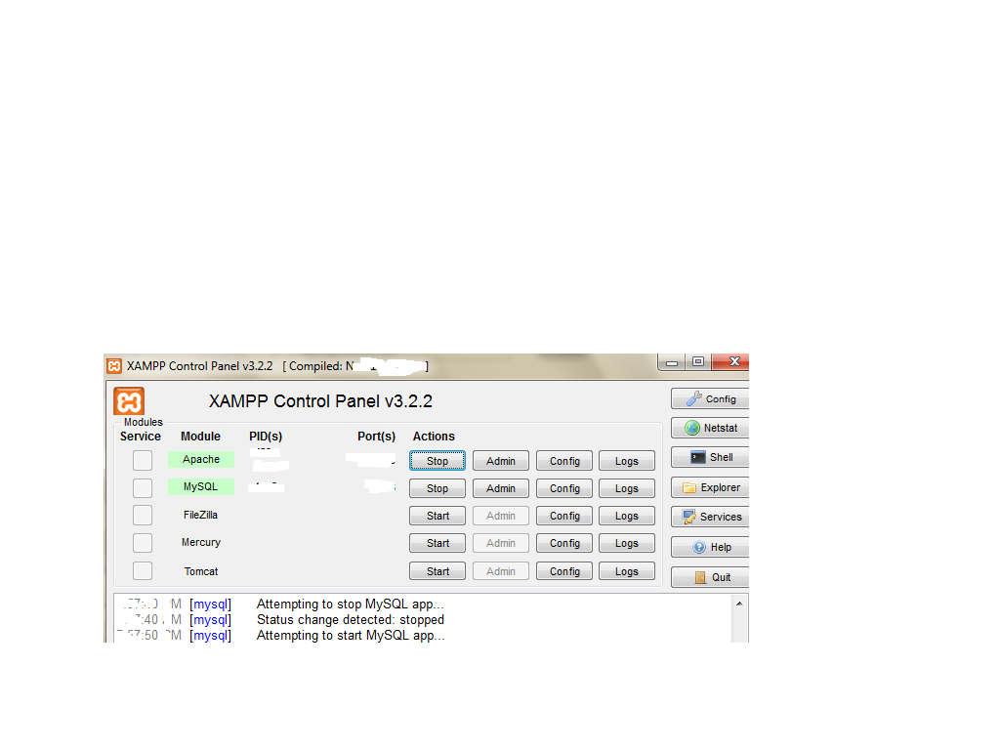
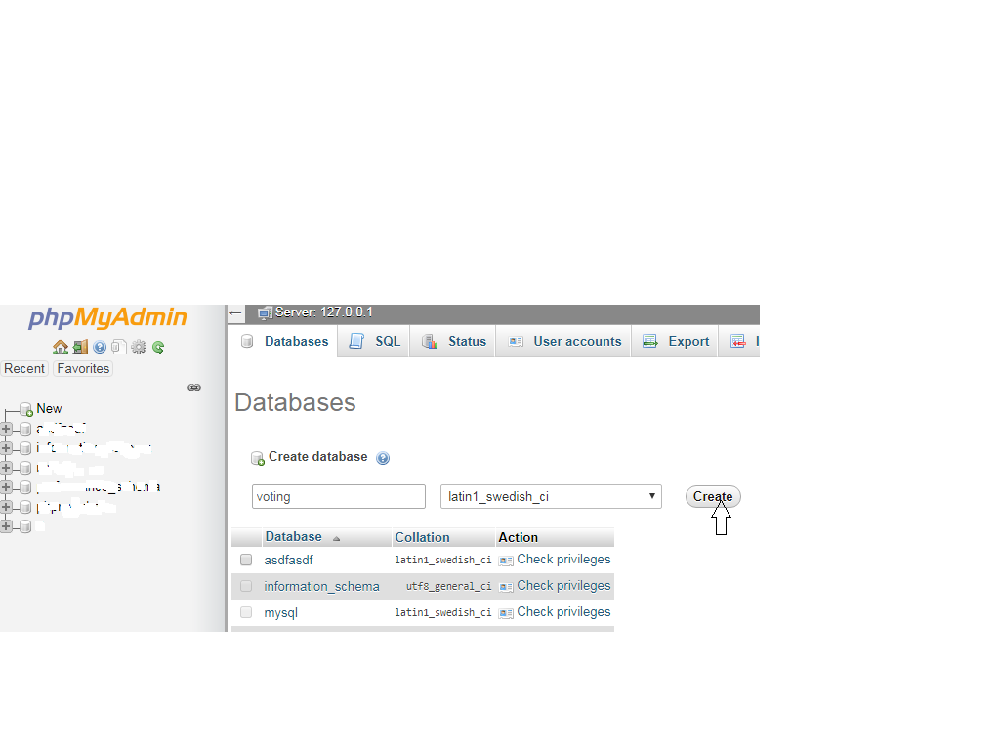
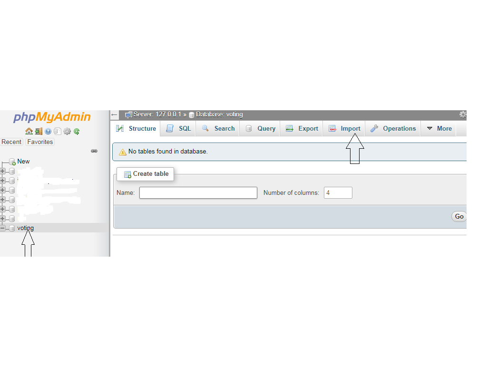
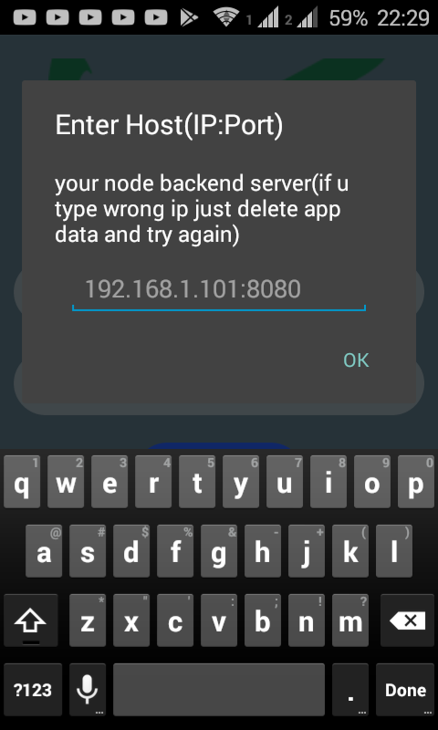

# ethVote-backEnd
<br/><br/>

### About
It is the backend of our ethereum based voting application.<br/>
All tasks are handled by this server and mobile is just an interface which will change on later iteration
### Installation Instructions<br/><br/>

##### Download Dependencies
1. Download and install node.js from [their website](https://nodejs.org/en/)
2. Download and instal xampp server (for mysql database and phpmyadmin xampp recommended) from [their website](https://www.apachefriends.org/index.html)
3. After nodejs is installed, Download ganache-cli (blockchain testrpc) and nodemon, open command prompt and type <br/>
        ```npm install -g ganache-cli``` <br/>
        ```npm install -g nodemon```
<br/>( nodemon which is very handy tool to make our server react to our code changes ) 

##### Download and install project
1. Clone the repository or download zip <br/>
            ```git clone  https://github.com/PrijalBista/ethVote-backEnd.git```
            
2. (Shift + Right click) on the Project Folder and open command prompt on that folder<br/> 

3. Now install all the local dependencies by typing command <br/>
           ``` npm install  ```
4. After all the modules have been installed we need to configure credentials for database connection

##### Configuring database<br/>
1.Mysql

  First open xampp control pannel and start mysql and apache service.<br/>
  <br/>
  Then open browser and go to the link [http://localhost/phpmyadmin]<br/>
  Then create a database named voting<br/>
  <br/>
  Then select voting database<br/>
  <br/>
  import tables: Go to import options choose file from  EthVote-backEnd/Databases/voting.sql<br/>
  <br/>
  scroll down and click go Now you can see the tables users(stores registered Voters ) and address tables<br/>
  
  >Inside ethVote-backEnd/Classes there is a file ConfigsTemplate.js which has following structure.<br/>
  
  ```javascript  
    var Configs ={
     mysql:{
       host:"",
       user:"",
       password:"",
       database:"voting"
      }
    }; 
    module.exports = Configs;
 ```
 Copy the Contents of ConfigsTemplate.js ```Ctrl+c``` Make a new file named **Configs.js** and paste it there<br/>
 
 Set host, user,password,.. etc according to your mysql configuration and then save the file as **Configs.js** <br/>
 >DONT rename or delete ConfigsTemplate.js just copy it and make another file named Config.js <br/>
 
 ##### Starting node server ()
  1. First run mysql server by opening xampp control panel and starting mysql and apache service.
  2. Open command prompt from anywhere and type<br/>
                          ```ganache-cli``` <br/>
      this will start local blockchain database in your computer NOTE: **donot close this cmd prompt (blockchain db will stop)**
  3. Open command prompt on your project directory (```SHIFT+RIGHT CLICK``` on project directory) and type <br/>
                         ```nodemon app``` <br/>
      server will be started on [http://localhost:8080]  NOTE:**DONOT close this command prompt (server will stop)<br/>
      

  #### Using the app
  
  1. Download and install app apk from the link [Download apk here](https://drive.google.com/open?id=1x6JGZSlGO0_45iVMqp2TE2WwBVbX1M4j)
  2. When you open it for the first time it asks for the host ip:port where you give ip of the node server you started above <br/>
    ie. ip of computer that you started your server with eg-192.168.1.101:8080 here is an screenshot <br/>
  <br/>
  3. Now mobile app can only register voters and give vote. The manager has to use browser to create and manage ballots and validate voters
  
 
